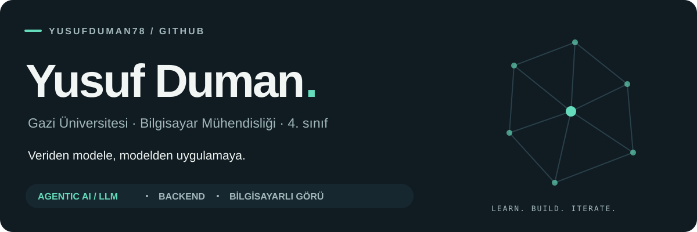
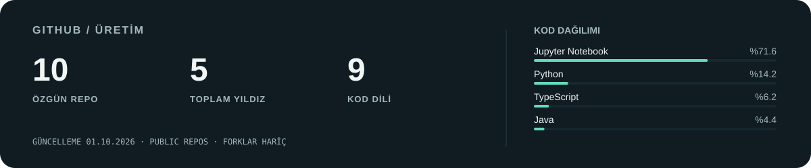

<picture>
  <source media="(prefers-color-scheme: dark)" srcset="assets/header-dark.svg">
  <source media="(prefers-color-scheme: light)" srcset="assets/header-light.svg">
  
</picture>

  <a href="https://www.linkedin.com/in/yusufduman78/">LinkedIn</a>
  &nbsp; · &nbsp;
  <a href="mailto:yusuf78duman@gmail.com">E-posta</a>
  &nbsp; · &nbsp;
  <a href="https://github.com/yusufduman78?tab=repositories">Tüm çalışmalarım</a>

### Merhaba, ben Yusuf.

Gazi Üniversitesi **Bilgisayar Mühendisliği 4. sınıf** öğrencisiyim. Yapay zekâ modellerini, onları kullanan backend servislerini ve uçtan uca çalışan uygulamaları birlikte geliştirmekle ilgileniyorum.

**Agentic AI, büyük dil modelleri (LLM) ve üretken yapay zekâ** başlıca ilgi alanlarım. **Bilgisayarlı görü, derin öğrenme ve backend geliştirme** üzerine de çalışıyor; öğrendiklerimi kişisel projeler, ders çalışmaları ve bootcamplerle uygulamaya döküyorum.

### Odaklandığım alanlar

| Agentic AI & LLM | Bilgisayarlı görü | Backend & uygulama |
| :--- | :--- | :--- |
| Üretken yapay zekâ, ajan tabanlı yaklaşımlar, RAG ve semantik arama. | Görüntü sınıflandırma, segmentasyon ve öneri sistemleri. | Modelleri API'lere, servis katmanlarına ve kullanılabilir arayüzlere bağlamak. |
| **LLM · NLP · Embeddings** | **PyTorch · OpenCV · FashionCLIP** | **Java · Python · FastAPI** |

### İlgi alanlarımın projelerdeki karşılığı

**[AI Audit Tool ↗](https://github.com/yusufduman78/Ai-Audit-Tool)** 
Yapılandırılmış kayıtları normalize edip bağlamla zenginleştiren ve LLM ile denetim raporu üretimine hazırlayan Java kütüphanesi. Core, OpenCode adaptörü ve yerel model demosu ayrı modüller halinde. 
Java · LLM entegrasyonu · Prompt tasarımı · Spring Boot · Ollama

**[SemFileX ↗](https://github.com/yusufduman78/SemFileX)** 
Yerel belgelerin içeriğinde semantik arama yapmayı ve belgelerle sohbet etmeyi sağlayan yapay zekâ destekli dosya gezgini. RAG yaklaşımını bir masaüstü deneyimine taşıyor. 
TypeScript · Tauri · Next.js · FastAPI · ChromaDB · RAG

**[WardrobeAware ↗](https://github.com/yusufduman78/WardrobeAware)** 
Görüntüden kıyafet sınıflandırma, arka plan ayırma ve kombin önerisi sunan ekip projesi. Bilgisayarlı görü modellerini bir mobil uygulama ve backend ile birleştiriyor. 
PyTorch · FashionCLIP · SegFormer · FastAPI · React Native

### Teknoloji çantam

**Yapay zekâ & veri** &nbsp; Python · PyTorch · TensorFlow · OpenCV · scikit-learn · NumPy · pandas

**Backend** &nbsp; Java · Spring Boot · FastAPI · ChromaDB

**Arayüz & uygulama** &nbsp; TypeScript · React · Next.js · React Native · Tauri

**Geliştirme araçları** &nbsp; Git · GitHub · Jupyter · VS Code

### GitHub'da üretim

<picture>
  <source media="(prefers-color-scheme: dark)" srcset="assets/github-stats-dark.svg">
  <source media="(prefers-color-scheme: light)" srcset="assets/github-stats-light.svg">
  
</picture>

Herkese açık, bana ait repolar üzerinden günlük güncellenir. Forklar hariç; dil dağılımı kod boyutuna göre hesaplanır.

  

  
<b>Katkılarımın animasyonu</b>

   
  <picture>
    <source media="(prefers-color-scheme: dark)" srcset="https://raw.githubusercontent.com/yusufduman78/yusufduman78/output/github-contribution-grid-snake-dark.svg">
    <source media="(prefers-color-scheme: light)" srcset="https://raw.githubusercontent.com/yusufduman78/yusufduman78/output/github-contribution-grid-snake.svg">
    
  </picture>

---

Bir proje, fikir veya iş birliği için [LinkedIn'den](https://www.linkedin.com/in/yusufduman78/) ya da [e-postayla](mailto:yusuf78duman@gmail.com) ulaşabilirsin.
